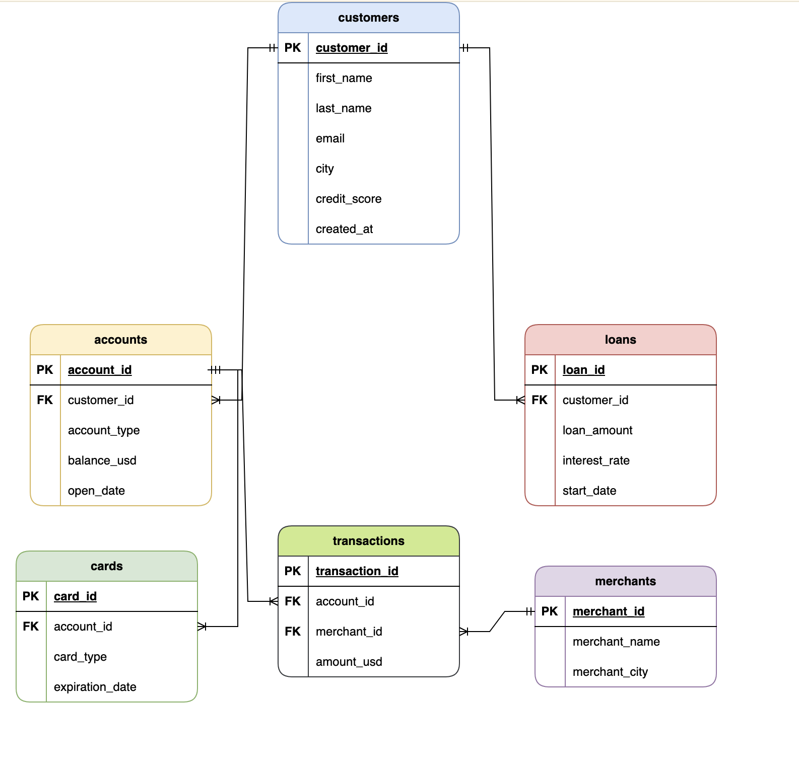
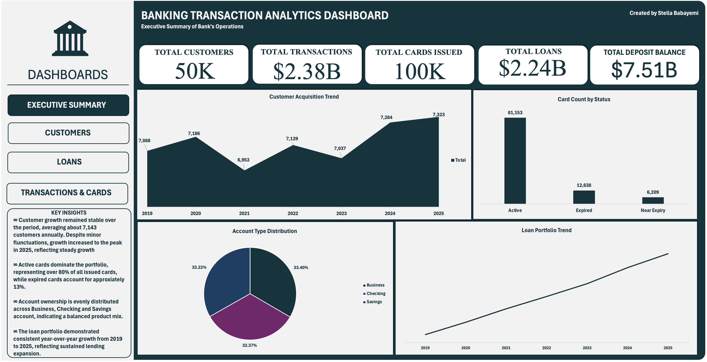
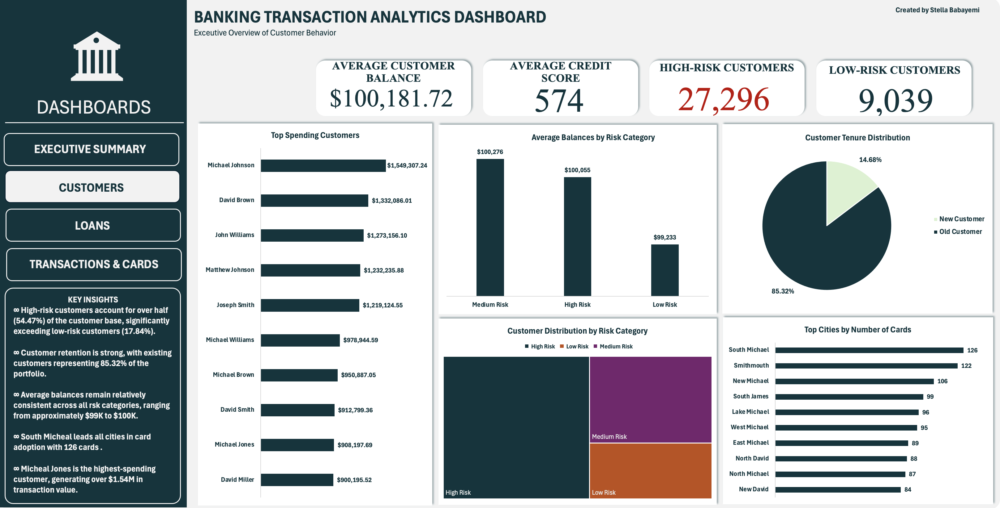
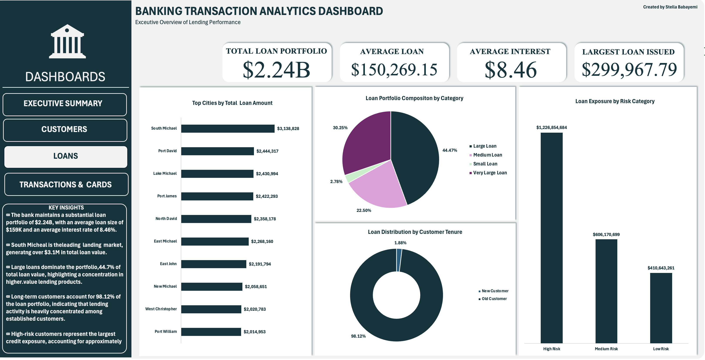
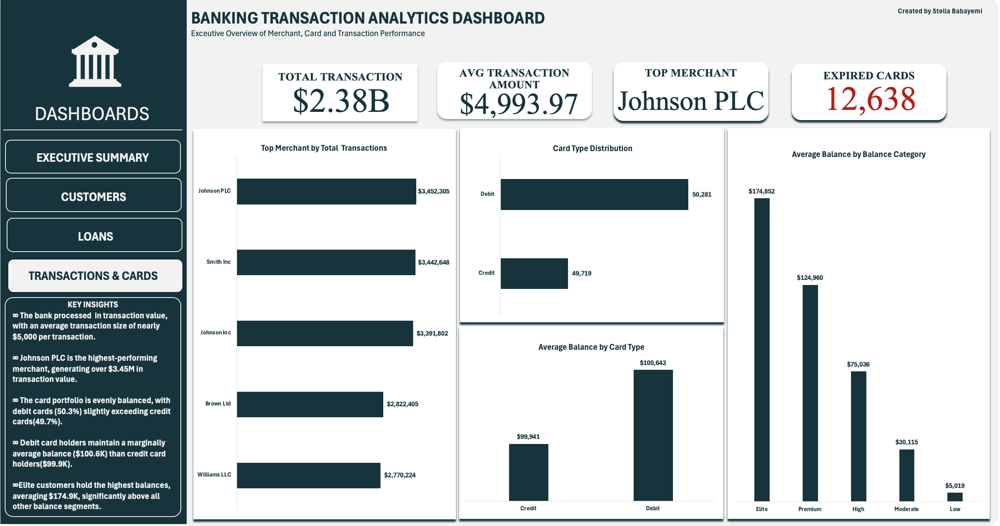

# Retail Banking Business Intelligence and Performance Analytics Using SQL and Excel

## Project Overview

This project presents an end-to-end Retail Banking Analytics solution developed using SQL Server and Microsoft Excel to analyze customer behavior, transaction activity, loan performance, card utilization, merchant activity, and risk exposure.

The objective was to transform raw banking data into actionable business intelligence through data cleaning, transformation, exploratory analysis, reporting views, and dashboard development. The project simulates a real-world banking analytics environment and demonstrates how financial institutions can leverage data to support strategic decision-making, risk management, customer growth, and operational performance.

---

## Business Problem

Retail banks generate large volumes of transactional and customer data across multiple systems. Without a unified analytical framework, it becomes difficult to:

* Monitor customer behavior effectively
* Assess loan portfolio risk
* Track product adoption and performance
* Identify high-value customers
* Detect unusual transaction patterns
* Measure overall business performance

This project addresses these challenges by creating a structured analytics framework that consolidates banking data into meaningful reports and executive dashboards.

---

## Project Objectives

The project was designed to:

* Build a SQL-based analytical data model for retail banking operations
* Create reporting layers for customer, account, transaction, card, merchant, and loan analysis
* Evaluate customer acquisition, retention, and segmentation trends
* Analyze transaction behavior and spending patterns
* Assess loan portfolio growth and risk exposure
* Measure card adoption and lifecycle performance
* Identify top-performing customers and merchants
* Develop interactive Excel dashboards for executive reporting

---

## Tools & Technologies

| Tool            | Purpose                                                  |
| --------------- | -------------------------------------------------------- |
| SQL Server      | Data cleaning, transformation, aggregation, and analysis |
| Microsoft Excel | Dashboard creation, visualization, and KPI reporting     |
| Google Docs     | Documentation                                            |
| Notion          | Project planning                                         |
| Draw.io         | Entity Relationship Diagram (ERD)                        |

---
## Project Structure

```text
Retail-Banking-Analytics/
│
├── docs/
│   └── Retail_Banking_Analytics_Documentation.docx
│
├── presentation/
│   └── Retail_Banking_Analytics_Presentation.pptx
│
├── scripts/
│   ├── 01_init_database.sql
│   ├── 02_raw/
│   │   └──ddl_raw_tables.sql
│   │
│   ├── 03_staging/
│   │   ├── data_quality_checks.sql
│   │   ├── ddl_staging_tables.sql
│   │   └── load_staging_tables.sql
│   │
│   ├── 04_analysis/
│   │   ├── account_analysis.sql
│   │   ├── card_analysis.sql
│   │   ├── customer_analysis.sql
│   │   ├── loan_analysis.sql
│   │   ├── merchant_analysis.sql
│   │   └── transaction_analysis.sql
│   │
│   └── 05_reports/
│       └── reporting_views.sql
│
├── visuals/
│   ├── ERD.png
│   ├── data_dictionary
│   ├── pivo_tables
│   ├── dashboard
│   │   ├── customers.png
│   │   ├── executive_summary.png
│   │   ├── loans.png
│   │   └──transactions_and_cards.png
│
├── LICENSE
│
└── README.md

```

---

## Project Files

Due to GitHub file size limitations, the Excel dashboard workbook is hosted on Google Drive.

📊 **Excel Workbook:**  
[Download workbook](https://drive.google.com/file/d/1Z2qkXFq3NAhcAuHQeimW0vgAOj7qsBAF/view)

📄 **Project Documentation:**  
Available in the `docs/` folder.

📈 **Presentation Slides:**  
Available in the `presentation/` folder.

---

## Dataset

### Source

Synthetic Retail Banking Dataset from [Kaggle](https://www.kaggle.com/datasets/akrambelha/synthetic-banking-dataset-csv-sql-sqlite).

The dataset contains simulated banking data representing:

* Customers
* Accounts
* Transactions
* Loans
* Cards
* Merchants

The data spans the period from **2019 to 2025** and was designed to replicate real-world retail banking operations.

---

## Data Limitations

While the dataset provides a comprehensive representation of retail banking operations, several limitations should be considered when interpreting the results.

### Geographic Limitation

The dataset contains synthetic city values generated for educational purposes. These locations do not correspond to real-world geographic regions and therefore cannot support accurate geographic or market-level analysis.

### Branch Data Limitation

The original dataset included a Branches table; however, it was excluded from the analytical model.

The table existed as a standalone entity with limited integration into the core banking data structure and lacked sufficient information to support meaningful branch performance analysis.

Additionally, branch location information could not be validated against real geographic hierarchies, making regional comparisons and branch-level reporting unreliable.

As a result, branch-related analysis was intentionally excluded from the scope of this project.

### Synthetic Data Consideration

The dataset is entirely synthetic and was created for analytical and educational purposes.
While the structure closely resembles real-world banking systems, the findings should not be interpreted as representing actual customer behavior or institutional performance.

---

## Data Model

The analytical model consists of six primary entities:


### Customers

Stores customer demographic information, credit scores, and risk-related attributes.

### Accounts

Contains account balances, account types, and account opening information.

### Transactions

Captures customer financial activity and serves as the primary fact table.

### Loans

Stores lending records including loan amounts, repayment information, and interest rates.

### Cards

Contains debit and credit card information associated with customer accounts.

### Merchants

Stores merchant information used for transaction and spending analysis.

The relational structure enables a complete 360-degree view of customer financial activity.

### Excluded Table

The original dataset included a Branches table. However, this table was excluded from the analytical model because it existed as a standalone entity without meaningful relationships to the core banking tables used in the analysis.

Additionally, branch location information could not be reliably validated for geographic analysis, limiting its analytical value for customer, transaction, loan, or merchant reporting.

As a result, the project focused on the six interconnected entities that supported end-to-end banking analytics:
- Customers
- Accounts
- Transactions
- Loans
- Cards
- Merchants

---

## Data Cleaning & Validation

To preserve data integrity, all transformations were performed on staging tables while raw data remained unchanged.

### Loan Validation

Loans were considered valid only when:

```sql
loan_start_date >= customer_creation_date
```

### Results

* Approximately **50.24%** of loan records were identified as invalid and removed.

### Transaction Validation

Transactions were considered valid only when:

```sql
transaction_date >= account_open_date
```

### Results

* Approximately **40.63%** of transaction records were removed due to temporal inconsistencies.

These validations ensured analytical accuracy across all reporting outputs.

---

## Feature Engineering

Several business-focused classifications were created to support segmentation and reporting.

### Risk Categories

| Credit Score | Risk Category |
| ------------ | ------------- |
| 750–850      | Low Risk      |
| 600–749      | Medium Risk   |
| Below 600    | High Risk     |

### Customer Type

| Customer Tenure             | Category     |
| --------------------------- | ------------ |
| Existing Customers          | Old Customer |
| Recently Acquired Customers | New Customer |

### Balance Categories

* Low
* Moderate
* High
* Premium
* Elite

### Loan Categories

* Small Loan
* Medium Loan
* Large Loan
* Very Large Loan

### Card Status

* Active
* Near Expiry
* Expired

---

# Executive Summary

## Portfolio Scale

The bank managed:

| Metric             | Value         |
| ------------------ | ------------- |
| Customers          | 50,000        |
| Transaction Value  | $2.38 Billion |
| Total Transactions | 477,060       |
| Deposit Portfolio  | $7.51 Billion |
| Loan Portfolio     | $2.24 Billion |
| Cards Issued       | 100,000       |

The results indicate a large and financially active retail banking ecosystem with substantial lending, transaction, and deposit activity.

---

# Key Findings

## 1. Customer Insights

### Customer Growth

Customer acquisition remained highly stable throughout the analysis period.

| Year | New Customers |
| ---- | ------------- |
| 2019 | 7,068         |
| 2025 | 7,323         |

Growth was consistent without major spikes or declines, suggesting steady customer acquisition performance.

### Customer Tenure

| Customer Type | Customers | Share  |
| ------------- | --------- | ------ |
| Old Customers | 42,659    | 85.32% |
| New Customers | 7,341     | 14.68% |

**Key Insight**

The customer base is strongly retention-driven, with more than four out of every five customers being long-standing account holders.

### Risk Distribution

| Risk Category | Customers | Share  |
| ------------- | --------- | ------ |
| High Risk     | 27,296    | 54.59% |
| Medium Risk   | 13,665    | 27.33% |
| Low Risk      | 9,039     | 18.08% |

**Key Insight**

More than half of all customers fall into the High-Risk category, creating significant credit and portfolio exposure.

---

## 2. Account Insights

### Account Type Distribution

| Account Type | Accounts | Share  |
| ------------ | -------- | ------ |
| Checking     | 25,090   | 33.45% |
| Savings      | 24,962   | 33.28% |
| Business     | 24,948   | 33.26% |

**Key Insight**

The bank maintains a highly balanced account portfolio with no single account type dominating customer usage.

### Account Balance Distribution

| Category | Accounts | Share  |
| -------- | -------- | ------ |
| Premium  | 18,875   | 25.17% |
| High     | 18,792   | 25.06% |
| Elite    | 18,739   | 24.99% |
| Moderate | 14,854   | 19.81% |
| Low      | 3,740    | 4.99%  |

**Key Insight**

Approximately **75% of all accounts** belong to High, Premium, or Elite balance segments, indicating strong overall customer financial health.

---

## 3. Card Insights

### Card Type Distribution

| Card Type | Cards  | Share  |
| --------- | ------ | ------ |
| Debit     | 50,281 | 50.28% |
| Credit    | 49,719 | 49.72% |

### Card Status

| Status      | Cards  | Share  |
| ----------- | ------ | ------ |
| Active      | 81,153 | 81.15% |
| Expired     | 12,638 | 12.64% |
| Near Expiry | 6,209  | 6.21%  |

**Key Findings**

* Card adoption is almost perfectly balanced between debit and credit products.
* More than **81% of cards remain active**, demonstrating strong customer engagement.
* Nearly **19% of cards require renewal or replacement**, presenting an opportunity for retention campaigns.

---

## 4. Loan Insights

### Loan Portfolio Performance

| Metric              | Value         |
| ------------------- | ------------- |
| Total Loans         | $2.24 Billion |
| Average Loan        | $150,269      |
| Maximum Loan        | $299,968      |
| Interest Rate Range | 2% – 15%      |

### Loan Portfolio Growth

Annual loan disbursement increased from:

* **$53.3 Million (2019)**
* **$602.1 Million (2025)**

This represents more than a tenfold increase in lending activity.

### Year-over-Year Growth

| Year | Growth  |
| ---- | ------- |
| 2020 | 158.99% |
| 2021 | 66.30%  |
| 2022 | 36.21%  |
| 2023 | 27.90%  |
| 2024 | 27.21%  |
| 2025 | 18.40%  |

**Key Insight**

Although growth percentages gradually declined, total lending volume continued to increase annually, indicating a transition from rapid expansion to mature portfolio growth.

### Loan Categories

| Category         | Loans |
| ---------------- | ----- |
| Medium Loans     | 5,032 |
| Large Loans      | 4,985 |
| Very Large Loans | 2,468 |
| Small Loans      | 2,446 |

**Key Insight**

The portfolio is heavily concentrated in medium and large loan products, reflecting a focus on higher-value lending opportunities.

---

## 5. Transaction Insights

### Transaction Performance

| Metric                  | Value         |
| ----------------------- | ------------- |
| Total Transaction Value | $2.38 Billion |
| Total Transactions      | 477,060       |
| Average Transaction     | $4,993.97     |
| Maximum Transaction     | $9,999.98     |

### High-Value Customers

The highest-spending customer generated:

**$1.55 Million** in transaction value.

Several top customers exceeded **$1 Million** in cumulative spending.

**Key Insight**

A relatively small group of customers contributes disproportionately to transaction activity, making them ideal candidates for premium banking programs and relationship management initiatives.

### Transaction Anomalies

Behavioral analysis identified customers whose maximum transaction values exceeded three times their average transaction amounts.

**Business Significance**

These patterns may indicate:

* High-value purchases
* Business-related transactions
* Fraud risks
* AML monitoring opportunities

---

## 6. Merchant Insights

### Top Merchant Performance

| Merchant     | Transaction Value |
| ------------ | ----------------- |
| Johnson PLC  | $3.45 Million     |
| Smith Inc    | $3.44 Million     |
| Johnson Inc  | $3.39 Million     |
| Brown Ltd    | $2.82 Million     |
| Williams LLC | $2.77 Million     |

**Key Insight**

A small group of merchants drives a substantial share of total transaction volume, creating both partnership opportunities and concentration risk.

---

# Dashboard Development

Four interactive dashboards were developed in Excel:

### Executive Summary Dashboard
 

Provides an overall view of:

* Customers
* Deposits
* Transactions
* Loans
* Cards

### Customer Dashboard


Focuses on:

* Customer segmentation
* Risk analysis
* Customer tenure
* Spending behavior
* Geographic distribution

### Loan Dashboard


Analyzes:

* Loan growth
* Risk exposure
* Loan categories
* Geographic concentration

### Transaction & Card Dashboard


Tracks:

* Transaction activity
* Merchant performance
* Card utilization
* Balance segmentation

---

# Business Recommendations

## Strengthen Risk Management

* Implement behavioral credit scoring models.
* Increase monitoring of high-risk customers.
* Conduct periodic loan portfolio stress testing.
* Deploy real-time fraud detection systems.

## Accelerate Customer Growth

* Expand acquisition efforts in underrepresented regions.
* Launch customer referral programs.
* Optimize digital onboarding processes.

## Increase Product Adoption

* Cross-sell higher-value financial products.
* Develop customer-tier-based marketing campaigns.
* Promote financial literacy initiatives.

## Improve Card Lifecycle Management

* Automate card renewal reminders.
* Launch proactive reissuance campaigns.
* Introduce incentives for timely renewals.

## Diversify Merchant Partnerships

* Expand merchant acquisition efforts.
* Reduce dependency on top-performing merchants.
* Leverage merchant analytics to identify growth opportunities.

---

# Conclusion

This project demonstrates how SQL and Excel can be leveraged to transform raw banking data into actionable business intelligence.

The analysis revealed a financially active institution characterized by:

* **50,000 customers**
* **$2.38 billion in transaction value**
* **$7.51 billion in deposits**
* **$2.24 billion in loans**
* **81% active card utilization**
* **Stable customer acquisition**
* **Strong long-term loan growth**

While the bank exhibits healthy operational performance and significant customer engagement, the analysis also uncovered areas requiring strategic attention, including high-risk customer concentration, loan exposure risk, card renewal opportunities, and merchant dependency.

By implementing data-driven strategies around risk management, customer growth, product adoption, and portfolio diversification, financial institutions can strengthen profitability, improve customer experience, and support long-term sustainable growth.

---

## Author

**Stella Babayemi**

Data Analyst | SQL | Excel | Business Intelligence | Data Visualization

This project was developed as part of a portfolio focused on real-world banking analytics, business intelligence reporting, and decision-support systems.

